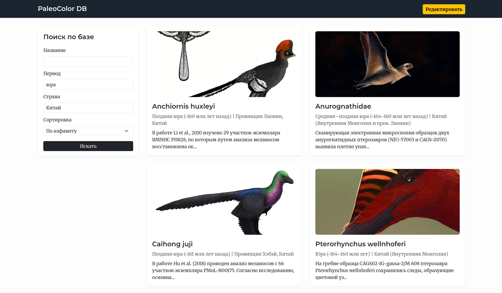
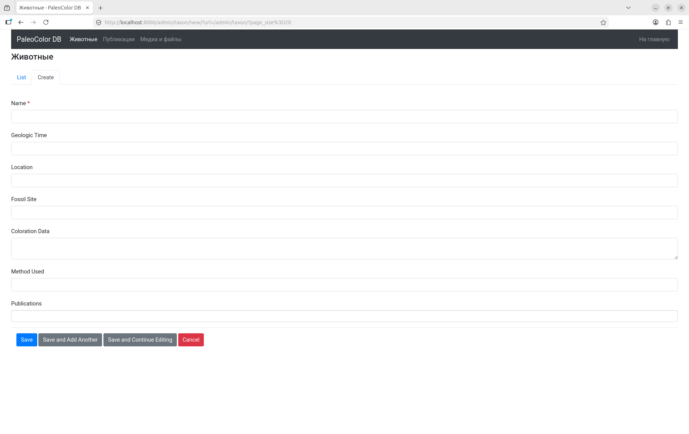

# Локальная веб-база данных по окраске ископаемых животных

Здесь собраны данные о животных, существовавших на Земле до начала кайнозойской эры, чья окраска в той или иной степени известна ученым. Приводится короткая справка по каждому из них, даются ссылки на оригинальные исследования и, если их материалы имеют открытый доступ, прилагаются PDF-файлы статей. Также здесь представлены художественные реконструкции животных, иллюстрации, показывающие их прижизненные размеры и фотографии окаменелостей.

База содержит представителей каждого периода от кембрийского до мелового. Их окраска изучалась множеством методов: от наиболее известного анализа меланосом (клеток, содержащих пигмент, по форме которых можно определить цвет) оперенных динозавров до прямого наблюдения прижизненных цветов птиц из бирманского янтаря, анализа дифракционных решеток на щетинках кембрийских полихет или предсказания цветовых паттернов по морфологии чешуи мумий эдмонтозавров из США.

Данные можно редактировать и пополнять. Также есть упрощенная версия (без возможности редактирования) в формате сайта, которая доступна по [ссылке](https://DmitryLashinMSU.github.io/PaleoColor_static/).

<p align="center">
  
</p>

## Установка

**Требования:** Установленные `Python 3`, `Docker` и `Docker Compose`.

**1. Скачайте проект**

```bash
git clone https://github.com/DmitryLashinMSU/PaleoColorDB.git
cd PaleoColorDB
```

**2. Скачайте архив с медиафайлами**

База данных сопровождается графическими материалами. Запустите скрипт, который скачает их с Google-диска и распакует в нужную директорию:

```bash
pip install gdown
python3 download_media.py
```

**3. Запустите приложение**

```bash
docker compose up -d --build
```

**4. Использование**
*   Откройте браузер по адресу: [http://localhost:8000](http://localhost:8000)
*   Для редактирования или добавления новых данных нажмите на кнопку `Редактировать` и выберите таблицу: `Животные`, `Публикации` или `Медиа и файлы`. При добавлении нового таксона первым делом заполняется таблица `Животные`. Если для него уже есть публикации, они добавляются сразу через эту таблицу, если нет — их можно добавить в `Публикации`, привязав соответствующее животное. В таблицу `Медиа и файлы` добавляются относительные пути к PDF-файлам статей и иллюстрациям, лежащим в `app/static/media_archive/`. Страница редактирования этой таблицы приведена на скриншоте ниже.

<p align="center">
  
</p>